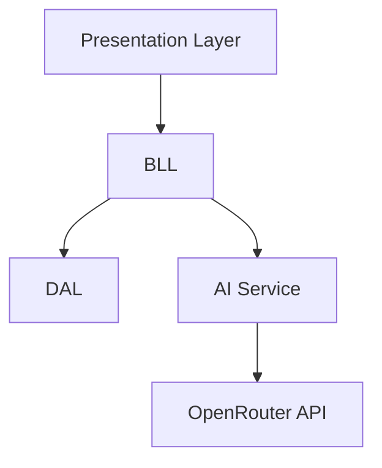

# CaptusGUI - Asistente Inteligente de Gestión de Tareas

[](https://dotnet.microsoft.com/)
[](LICENSE.md)
[](https://openrouter.ai/)
[](https://www.microsoft.com/windows)


## 📑 Tabla de Contenidos
- [Descripción](#-descripción)
- [Características](#-características-principales)
- [Comenzando](#-comenzando)
- [Uso](#-uso)
- [Arquitectura](#️-arquitectura)
- [Configuración](#-configuración)
- [Pruebas](#-pruebas)
- [Solución de Problemas](#-solución-de-problemas)
- [Seguridad](#-seguridad)
- [Versiones](#-versiones)
- [Desarrollo](#-desarrollo)
- [Roadmap](#-roadmap)
- [Contribución](#-contribución)
- [Equipo](#-equipo)
- [Agradecimientos](#-agradecimientos)

## 📋 Descripción

CaptusGUI es una aplicación de escritorio moderna que combina la gestión de tareas con inteligencia artificial para ofrecer una experiencia de usuario intuitiva y eficiente. Permite a los usuarios gestionar sus tareas, notas y actividades académicas a través de una interfaz gráfica amigable y comandos en lenguaje natural.

### 🎯 Objetivos
- Simplificar la gestión de tareas diarias
- Proporcionar asistencia inteligente
- Mejorar la productividad académica
- Ofrecer una experiencia de usuario excepcional

## ✨ Características Principales

### 🤖 Asistente IA Integrado
- Procesamiento de lenguaje natural para comandos
  - Soporte para comandos estructurados y conversacionales
  - Extracción inteligente de fechas relativas (ej: "el 28 de este mes")
  - Interpretación de prioridades en lenguaje natural (ej: "es importante", "no es urgente")
  - Reconocimiento de categorías en contexto conversacional
- Respuestas contextuales y personalizadas
- Soporte para múltiples idiomas
- Integración con OpenRouter API
- Sistema de procesamiento de comandos JSON estructurado
- Manejo de errores y validación de respuestas IA
- Formato de respuesta estandarizado para todas las acciones
- Prompt engineering optimizado para comandos de tareas
- Few-shot learning con ejemplos de comandos exitosos

### 📝 Gestión de Tareas
- Creación, actualización y eliminación de tareas
- Categorización y priorización
- Fechas límite y recordatorios
- Notificaciones por correo electrónico
- Extracción inteligente de fechas relativas (ej: "el 11 de este mes")
- Validación automática de campos requeridos
- Sistema de prioridades predefinidas (alta, media, baja)
- Categorías predefinidas (universidad, trabajo, personal)

### 📊 Gestión Académica
- Cálculo de notas y promedios
- Seguimiento de materias
- Historial académico
- Reportes y estadísticas
- Cálculo de promedios semestrales y acumulados
- Gestión de notas por materia
- Sistema de consulta de notas históricas

## 🚀 Comenzando

### Requisitos Previos
- .NET Framework 4.7.2 o superior
- Visual Studio 2019 o superior
- Cuenta en OpenRouter (para funcionalidades de IA)

### Instalación
1. Clona el repositorio:
```bash
git clone https://github.com/yourusername/CaptusGUI.git
```

2. Abre la solución en Visual Studio:
```bash
cd CaptusGUI
CaptusGUI.sln
```

3. Restaura los paquetes NuGet:
```bash
dotnet restore
```

4. Compila y ejecuta:
```bash
dotnet build
dotnet run
```

## 💻 Uso

### Comandos en Lenguaje Natural
CaptusGUI entiende comandos en lenguaje natural. Puedes usar tanto comandos estructurados como lenguaje conversacional:

#### Comandos Estructurados
```plaintext
@Captus crear tarea Reunión de equipo descripción Discutir progreso del proyecto X para 2024-07-25 prioridad alta categoría trabajo
@Captus crear tarea Comprar víveres para 2024-07-26 categoría personal
@Captus crear tarea Terminar informe mensual prioridad media categoría trabajo
```

#### Comandos Conversacionales
```plaintext
@Captus, por favor crea una tarea que se llame "Organizar archivos", que trata de clasificar los documentos digitales de mi proyecto final, para el 28 de este mes, es importante y es de la categoría universidad.
@Captus, necesito que crees una tarea para preparar la presentación final de mi proyecto. Es para el 29 de julio, es muy importante y es de la universidad.
@Captus, quiero que me recuerdes hacer ejercicio el 28 de julio. Es una tarea personal.
```

### Ejemplos de Prompts
Aquí tienes más ejemplos de prompts que puedes probar:

#### Prompts Estructurados
1. `@Captus crear tarea Preparar presentación final descripción Ensayar exposición del proyecto para 2024-07-29 prioridad alta categoría universidad`
2. `@Captus crear tarea Revisar código fuente descripción Depurar errores en módulo principal para 2024-07-27 prioridad alta categoría trabajo`
3. `@Captus crear tarea Hacer ejercicio para 2024-07-28 categoría personal`
4. `@Captus crear tarea Actualizar documentación prioridad media categoría trabajo`
5. `@Captus crear tarea Investigar nuevas tecnologías descripción Analizar frameworks para el proyecto para 2024-07-30 prioridad alta categoría universidad`

#### Prompts Conversacionales
1. `@Captus, necesito que crees una tarea para revisar el código del módulo principal. Necesito encontrar y corregir los errores antes del 27 de julio. Es de alta prioridad y es para el trabajo.`
2. `@Captus, quiero que me recuerdes hacer ejercicio el 28 de julio. Es una tarea personal.`
3. `@Captus, necesito actualizar la documentación del proyecto. No es urgente, pero es importante para el trabajo.`
4. `@Captus, por favor crea una tarea para investigar nuevos frameworks. Necesito analizar las opciones para el proyecto antes del 30 de julio. Es de alta prioridad y es para la universidad.`
5. `@Captus, quiero que me recuerdes limpiar la casa el 27 de julio. Es una tarea personal.`

### Gestión de Tareas
```csharp
// Ejemplo de creación de tarea
var task = new Task {
    Title = "Estudiar Matemáticas",
    EndDate = DateTime.Now.AddDays(7),
    Priority = Priority.High,
    Category = Category.Academic
};
taskLogic.Save(task);
```

### Notificaciones
```csharp
// Ejemplo de envío de notificación
await NotifyEmails.SendNotifyAsync(
    user.Email,
    "Nueva Tarea Creada",
    $"Se ha creado la tarea: {task.Title}"
);
```

## 🏗️ Arquitectura

### Capas de la Aplicación
1. **Presentation Layer**
   - Interfaz de usuario (Windows Forms)
   - Controladores de eventos
   - Validación de entrada
   - Sistema de notificaciones visuales
   - Manejo de errores en la interfaz

2. **Business Logic Layer (BLL)**
   - Lógica de negocio
   - Procesamiento de comandos
   - Integración con IA
   - Sistema de procesamiento de comandos JSON
   - Validación de datos y respuestas
   - Manejo de errores y excepciones
   - Procesamiento de fechas relativas

3. **Data Access Layer (DAL)**
   - Acceso a base de datos
   - Operaciones CRUD
   - Manejo de transacciones
   - Validación de integridad de datos
   - Sistema de respaldo y recuperación

### Componentes Principales
1. **AIService**
   - Integración con OpenRouter API
   - Procesamiento de prompts
   - Manejo de respuestas JSON
   - Sistema de errores y reintentos
   - Configuración de parámetros de IA

2. **CommandProcessor**
   - Procesamiento de comandos en lenguaje natural
   - Validación de estructura JSON
   - Extracción de datos relevantes
   - Manejo de errores de parseo
   - Sistema de respuestas estandarizadas

3. **TaskManager**
   - Gestión completa de tareas
   - Validación de datos
   - Sistema de prioridades
   - Categorización automática
   - Procesamiento de fechas

4. **NotificationService**
   - Sistema de notificaciones
   - Envío de correos electrónicos
   - Alertas visuales
   - Programación de recordatorios
   - Manejo de preferencias de notificación

### Diagrama de Arquitectura


## 🔧 Configuración

### Variables de Entorno
```plaintext
OPENROUTER_KEY=tu_api_key
SMTP_SERVER=tu_servidor_smtp
SMTP_PORT=587
AI_MODEL=deepseek/deepseek-chat-v3-0324:free
AI_TEMPERATURE=0.2
AI_MAX_TOKENS=500
```

### Configuración de IA
```json
{
  "AISettings": {
    "Model": "deepseek/deepseek-chat-v3-0324:free",
    "Temperature": 0.2,
    "MaxTokens": 500,
    "SystemPrompt": "Eres Captus, un asistente de gestión de tareas especializado en procesar comandos de creación de tareas. Tu objetivo es generar respuestas en formato JSON para las siguientes acciones: crear_tarea, actualizar_tarea, eliminar_tarea, consultar_tareas, calcular_nota, calcular_promedio. Para crear_tarea, el JSON debe incluir: título (obligatorio), descripción (opcional), fecha (obligatorio), prioridad (obligatorio: alta, media, baja), categoría (obligatorio: universidad, trabajo, personal). Si falta un campo obligatorio, responde con un error específico. Si falta un campo opcional, asigna null. NO respondas de forma conversacional. SIEMPRE genera el JSON correspondiente a la acción solicitada."
  }
}
```

### Configuración de Base de Datos
```json
{
  "ConnectionStrings": {
    "DefaultConnection": "Server=localhost;Database=CaptusDB;Trusted_Connection=True;"
  }
}
```

## 🧪 Pruebas

### Pruebas Unitarias
```csharp
[Test]
public void CreateTask_ValidData_ReturnsSuccess()
{
    // Arrange
    var task = new Task { Title = "Test Task" };
    
    // Act
    var result = taskLogic.Save(task);
    
    // Assert
    Assert.IsTrue(result.Success);
}
```

### Pruebas de Integración
```csharp
[Test]
public async Task ProcessCommand_ValidInput_ReturnsExpectedResponse()
{
    // Arrange
    var command = "@Captus crea una tarea";
    
    // Act
    var response = await commandProcessor.ProcessCommand(command);
    
    // Assert
    Assert.Contains("tarea creada", response.ToLower());
}
```

## 📈 Roadmap

- [ ] Integración con calendario
- [ ] Sincronización con servicios en la nube
- [ ] Aplicación móvil
- [ ] Análisis predictivo de tareas
- [ ] Integración con más servicios de IA

## 🤝 Contribución

1. Fork el proyecto
2. Crea tu rama de características (`git checkout -b feature/AmazingFeature`)
3. Commit tus cambios (`git commit -m 'Add some AmazingFeature'`)
4. Push a la rama (`git push origin feature/AmazingFeature`)
5. Abre un Pull Request

## 📝 Licencia

Este proyecto está bajo la Licencia MIT - ver el archivo [LICENSE.md](LICENSE.md) para más detalles.

## 👥 Equipo

### Desarrolladores
- **David Barceló** - *Desarrollador Principal*
  - Experto en .NET y arquitectura de software
  - [GitHub](https://github.com/davidbarcelo)
  - [LinkedIn](https://linkedin.com/in/davidbarcelo)

- **Harold Florez** - *Arquitecto de Software*
  - Especialista en patrones de diseño y SOLID
  - [GitHub](https://github.com/haroldflorez)
  - [LinkedIn](https://linkedin.com/in/haroldflorez)

- **Valentina Molina** - *Diseñadora UI/UX*
  - Experta en diseño de interfaces y experiencia de usuario
  - [GitHub](https://github.com/valentinamolina)
  - [LinkedIn](https://linkedin.com/in/valentinamolina)

### Contacto
- Email: captus@example.com
- Twitter: [@CaptusGUI](https://twitter.com/CaptusGUI)
- LinkedIn: [CaptusGUI](https://linkedin.com/company/captusgui)
- Discord: [CaptusGUI Community](https://discord.gg/captusgui)

## 🙏 Agradecimientos

- OpenRouter por proporcionar la API de IA
- La comunidad de .NET
- Todos los contribuidores que han ayudado al proyecto
- Nuestros usuarios por su valioso feedback

## 🔍 Solución de Problemas

### Problemas Comunes

#### Error de Conexión con OpenRouter
```plaintext
Error: No se pudo conectar con el servicio de IA
Solución: Verifica tu API key en las variables de entorno
```

#### Error de Base de Datos
```plaintext
Error: No se pudo conectar a la base de datos
Solución: Verifica la cadena de conexión y que SQL Server esté ejecutándose
```

#### Error de Notificaciones
```plaintext
Error: No se pudieron enviar las notificaciones
Solución: Verifica la configuración SMTP y las credenciales
```

### Guía de Depuración
1. Revisa los logs en `logs/application.log`
2. Verifica las variables de entorno
3. Comprueba la conexión a servicios externos
4. Valida los permisos de la base de datos

### Diagnóstico Rápido
```bash
# Verificar estado de servicios
dotnet run --check-services

# Verificar configuración
dotnet run --check-config

# Verificar conexiones
dotnet run --check-connections
```

## 🔒 Seguridad

### Políticas de Seguridad
- Encriptación de datos sensibles (AES-256)
- Autenticación de dos factores (2FA)
- Sesiones seguras con JWT
- Protección contra ataques comunes (OWASP Top 10)

### Manejo de Datos
- Las contraseñas se almacenan con hash bcrypt
- Los tokens de API se cifran
- Los datos personales se protegen según GDPR
- Backups automáticos diarios

### Buenas Prácticas
1. Nunca compartas tus API keys
2. Mantén actualizado el sistema
3. Usa contraseñas fuertes
4. Reporta vulnerabilidades

### Auditoría de Seguridad
```bash
# Ejecutar escaneo de seguridad
dotnet run --security-scan

# Verificar dependencias
dotnet run --check-dependencies

# Generar reporte de seguridad
dotnet run --security-report
```

## 📦 Versiones

### Historial de Cambios

#### v1.2.0 (Actual)
- Mejora en el procesamiento de comandos naturales
- Corrección de errores de concurrencia
- Optimización de rendimiento
- Nuevas características de IA

#### v1.1.0
- Integración con OpenRouter
- Sistema de notificaciones
- Mejoras en la UI

#### v1.0.0
- Lanzamiento inicial
- Funcionalidades básicas
- Integración con IA

### Compatibilidad
- Windows 10/11
- .NET Framework 4.7.2+
- SQL Server 2019+
- Visual Studio 2019+

## 👨‍💻 Desarrollo

### Guía de Estilo
```csharp
// Convenciones de nombrado
public class TaskManager { }  // PascalCase para clases
private string _taskName;     // _camelCase para privados
public void ProcessTask() { } // PascalCase para métodos

// Documentación
/// <summary>
/// Procesa una tarea y actualiza su estado
/// </summary>
/// <param name="task">La tarea a procesar</param>
/// <returns>Resultado del procesamiento</returns>
```

### Estructura de Carpetas
```
CaptusGUI/
├── Presentation/     # Capa de presentación
├── BLL/             # Lógica de negocio
├── DAL/             # Acceso a datos
├── ENTITY/          # Modelos y entidades
├── Tests/           # Pruebas unitarias
└── Docs/            # Documentación
```

### Flujo de Trabajo
1. Crear rama desde `develop`
2. Implementar cambios
3. Ejecutar pruebas
4. Crear Pull Request
5. Revisión de código
6. Merge a `develop`

---

⭐️ Si te gusta el proyecto, ¡déjanos una estrella!

[Volver arriba](#captusgui---asistente-inteligente-de-gestión-de-tareas)